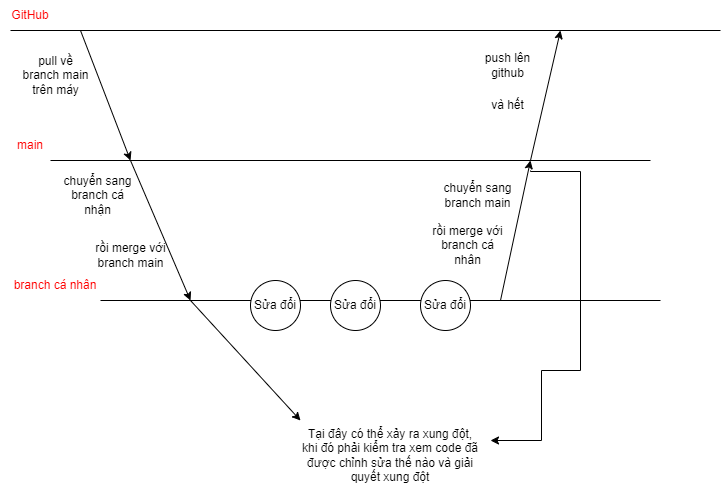

# SS004.10 - ĐỒ ÁN CUỐI KỲ

# TRÒ CHƠI CON RẮN

## Thành Viên Nhóm

- **[Nguyễn Nhật Huy]** (Nhóm Trưởng)
- [Lê Tấn Thành]
- [Đặng Nguyễn Huy Hoàng]
- [Lâm Đỗ Kiến Thức]

## Quy Trình Làm Việc

1. Pull từ main vào local (máy của bạn) trước để đảm bảo branch được cập nhật
2. Chuyển sang branch cá nhân của bạn (ví dụ: huy)
3. Thực hiện merge main vào develop trước khi làm việc để không bỏ sót thay đổi từ sản phẩm chính. Tuy nhiên giai đoạn này có thể xảy ra xung đột
4. Add, Commit và Push các thay đổi trên branch cá nhân và chỉ sau khi hoàn thành mới merge ngược lại vào main để đảm bảo nhánh chính chỉ chứa các tính năng hoàn thiện.
5. Push branch main lên GitHub để cập nhật repository chính.
