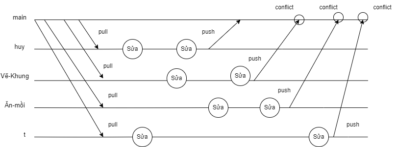

# SS004.10 - ĐỒ ÁN CUỐI KỲ

# TRÒ CHƠI CON RẮN

## Thành Viên Nhóm

- **[Nguyễn Nhật Huy]** (Nhóm Trưởng)
- [Lê Tấn Thành]
- [Đặng Nguyễn Huy Hoàng]
- [Lâm Đỗ Kiến Thức]

## Quá trình làm việc

1. Đầu tiên vào branch cá nhân của mình, **git pull origin main** (git desktop sẽ khác) để cập nhật nội dung mới nhất của branch main trên github
2. Sau khi chỉnh sửa repository xong, **git push origin main** (git desktop sẽ khác) nó lên trên github và đợi nhóm trưởng chấp nhận yêu cầu, giải quyết xung đột (nếu có)
3. Lặp lại

## Lưu Ý

- Không được làm việc trên branch **main**
- Cần phải để ý trong bước 2 quá trình làm việc, bạn đã **push** nó lên đúng branch main hay không vì có khả năng push nhầm nó lên branch cá nhân của bản thân trên github. Tuy nhiên **push** nhầm cũng không sao

=======
### Quá trình làm việc

1. Đầu tiên vào branch **main** kiểm tra xem repository của mình đã được cập nhật mới bằng với trên github chưa:
   - Nếu chưa thì **_pull_** nó xuống
   - **_pull_** xong thì **_merge_** nó với branch cá nhân của mình và làm việc trên branch cá nhân đó
2. Sau khi chỉnh sửa xong, **_push_** nó lên trên github và đợi nhóm trưởng chấp nhận yêu cầu, giải quyết xung đột (nếu có)
3. Lặp lại